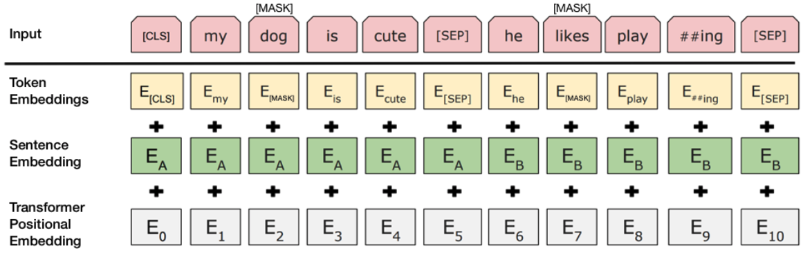

# Fine-Tuned BERT model to Classify Natural-Disaster-Tweets

This project is part of a Kaggle NLP competition to classify whether a series of tweets is related to a natural disaster or not. I achieved a test accuracy of 82% and validation accuracy of 83% which placed me in the top 25% of all kagglers in the competition. (In reality, my position is much higher because many submissions by bots have an unfeasible accuracy of 1.0 and get ranked high on the leaderboard).

## Brief Summary
Using natural language processing, I built a text pipeline to clean text by removing special characters, lemmatization, and extensively use the nltk package for preprocessing. Moreover, I encode the clean English text and use BERT encoding to make the text ready for the neural network. Finally, I feed the text into a custom-built feed-forward model I build on top of a pre-trained BERT (Bidirectional Encoder Text Representation) model made by Google. I also tune my custom-built model using Keras Tuner and tune the dropout regularization rate, number of neurons in the hidden layer, learning rate alpha.

## Model in this Problem

The model uses a pre trained BERT layer from Google with L=12 hidden layers (i.e., Transformer blocks), a hidden size of H=768, and A=12 attention heads. On top of that a custom feed-forward model is built which has 2 hidden layers with activation "ELU" and one classification layer with the Sigmoid activation function. The model uses the ADAM optimization algorithm and uses 3 epochs to train the model with a model batch size of 32(recommended by Google Research team).

## About BERT
BERT is a Transformers based NLP technique used for various problems such as Seq2Seq, Seq2Vec, Vec2Seq problems. It's a pretrained model developed by Google on a large textual database scraped from the internet. Transformers have an architecture that's composed of an encoder and a decoder, where an encoder helps the model learns a whole sentence and it's "bidirectional Context" captures the whole context of the sentence. This makes BERT a popular choice among NLP tasks as learning a whole sentence(not word by word) with parallelization and context awareness makes the model Robust.
My model image generated from Keras plot utils:

# Images

My Keras generated Model


BERT encoder

## Want to Try out?
1. Since the model file is over 1GB, you might need git lfs to pull the project via cli. If not you can manually try to download it by clicking the download repo button on the Github Repo.
2. Reccomended to use Anaconda as a isolated package environment. To create a env with the neccessary packages run ```conda create --name <env_name> --file requirements.txt```
3. If you don't have conda(not reccomended), run ```pip3 install -r requirements.txt``` to install the packages and follow step 4.
4. IMPORTANT (source: https://stackoverflow.com/a/57164633/10016132): In your Conda env or local env, make sure to create env variable ```export PYTHONPATH="${PYTHONPATH}:/path/to/your/project/"``` for Linux/OS X or ```set PYTHONPATH=%PYTHONPATH%;C:\path\to\your\project\``` for Windows
5. Run ```python3 run-sentence.py``` and once the prompt shows, type a sentence and see your sentence's relation probability with a disaster or not.

## Author
If you have any questions regarding the code please email me at rohandeshpande832@gmail.com thanks.